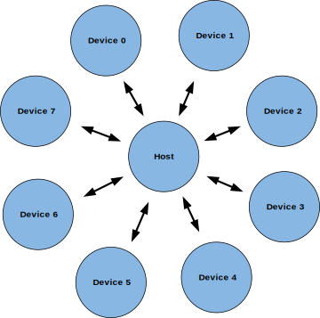
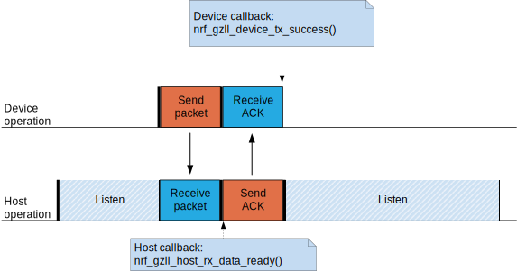
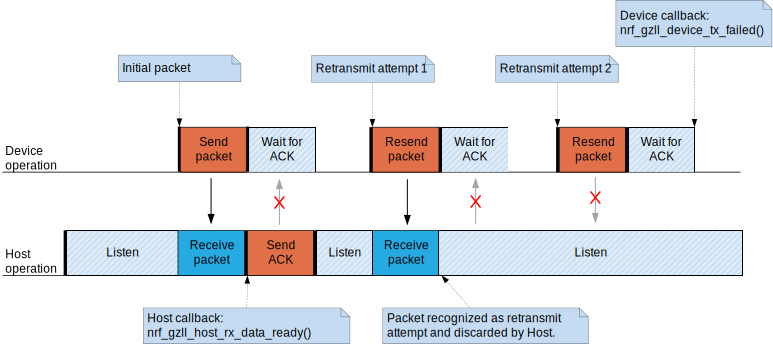
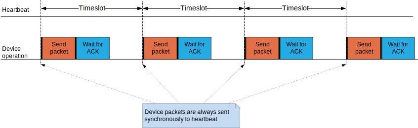
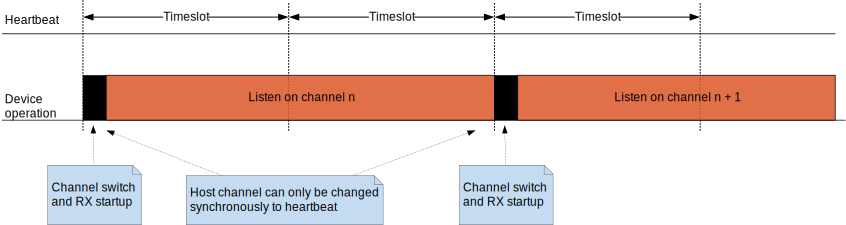
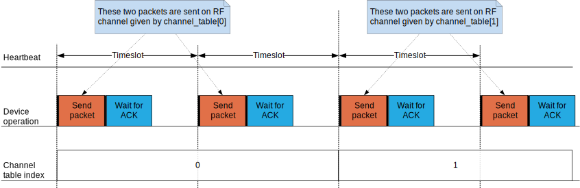
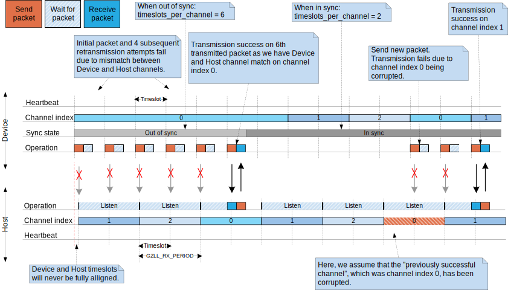

.. _ug_gzll:

Gazell Link Layer
#################

.. contents::
   :local:
   :depth: 2

Introduction
************

.. gzll_intro_start

Gazell is a protocol for setting up a robust wireless link between a single Host and up to eight Devices in a star network topology.
It is designed to minimize power consumption in power-sensitive wireless desktop products and is also suitable for a range of other wireless applications.

.. gzll_intro_end

To minimize the power consumption of the power-sensitive peripheral devices, Gazell uses the central hub (host side) with its more relaxed power constraints to keep the link open while the peripheral devices can sleep and save on power consumption.
A typical example of this is a wireless mouse communicating with a USB dongle that is inserted into a computer.

Gazell has a sophisticated but easy-to-use channel switching and synchronization scheme, that gives robustness against interference and good wireless coexistence properties while still enabling high-throughput and low latency.

Features
********

* Supports a star network topology with one Host and up to 8 Devices.
* Bidirectional data transfer between each Host and Device.
* Channel hopping functionality that gives a reliable wireless link in environments with interference from other radio sources.
* Packet acknowledgement and automatic packet retransmission functionality to prevent data loss.
* Individual TX and RX FIFOs for every data pipe.
* Backward compatible with legacy nRF24L Series Gazell.
* Devices self-synchronize to the Host, meaning:

  * No connection packets are required to setup a link.
  * No polling packets are required to maintain a link.
  * Devices can enter and remove themselves from the network at any time.

* Capability to control RF Frontend Module.
* Generates transmission statistics per each RF channel.

.. _ug_gzll_resources:

Resources
*********

Gazell makes use of a fixed set of peripheral resources in nRF5 SoC.
To ensure correct operation, Gazell requires exclusive access to the resources.

* Radio
* Timer
* 3 PPI channels
* Software interrupt (SWI)

The radio and timer interrupt handlers run at priority level 0 (highest level), and the Gazell callback functions run at priority level 1.
Applications should run at priority level 2 or higher in order to ensure correct operation.

Gazell can be customized at runtime for a range of different applications.
See the Gazell Link Layer for a list of configuration functions as well as the default and constant parameters.

Note: Editing the header file containing the default and constant parameters does not change their value when compiling a new project.
These values are provided as a useful reference when making an application with the precompiled library.

Gazell modes
************

A member of a Gazell star network is either a Host or Device.
Up to 8 Devices can communicate with a single Host.
Each Host can communicate with up to 8 Devices.
Each Device communicates to a single Host.

   Gazell star network

Once enabled, the Host in a Gazell network is always listening, and it is the Device that always initiates a communication.
Each packet that a Device sends is required to be acknowledged by the Host.
It is possible for the Host to send data to the Device by piggybacking data to an acknowledgement (ACK) packet.
Therefore a Host has to wait for a packet from a Device before it can send any data to it.

It is possible to build more sophisticated Gazell networks, since a single Device is able to speak to several Hosts and any node is able to change between the two modes.
However, this requires the application to coordinate such a network.

In this document, we focus here on the typical use-case as a star network with static modes.

Setting up a Gazell application
*******************************

Gazell automatically handles all synchronization and packet handling.
All the user is required to do is to add payloads to the transmit (TX) FIFOs and read payloads from the receive (RX) FIFOs.
Gazell automatically notifies the application when a packet is received.

To set up a Gazell application, do the following:

* Initialize Gazell using nrf_gzll_init() and choose either Host or Device.
* Reconfigure Gazell's default parameters.
  At a minimum the addresses and channels should be reconfigured to avoid interfering with other Gazell networks.
* Enable Gazell using nrf_gzll_enable().
* If the node is a Device, start sending:

  * Add payloads to the TX FIFO using nrf_gzll_add_packet_to_tx_fifo().
  * Handle the returned ACK packet when the nrf_gzll_device_tx_success() callback is called.
    Fetch the payloads from the RX FIFO using nrf_gzll_fetch_packet_from_rx_fifo().
  * Handle the failed packet transmissions when the nrf_gzll_device_tx_failed() callback is called.
    Failed packets are automatically removed from the TX FIFO.

* If the node is a Host, start listening:

  * Handle the received data packets when the nrf_gzll_host_rx_data_ready() calbback is called.
    Fetch the packets from the RX FIFO using nrf_gzll_fetch_from_rx_firo().
  * Add any payloads to send to the TX FIFO using nrf_gzll_add_packet_to_tx_fifo().

Gazell can also be disabled at any time using the nrf_gzll_disable() function.
When this is called Gazell will complete any ongoing transmission or reception before being disabled.
(That is, until the end of the current timeslot, a concept we explain later in the section on Timeslots).
When the disabling operation is complete, Gazell will call the nrf_gzll_disabled() function.
By the time this callback is made, the Gazell CPU context, radio and Gazell timer will have stopped.
It is now possible to call any of the configuration set functions, which will be in force, once Gazell is enabled again.

Package transactions
********************

A typical packet transaction between a Device and a Host consists of a Device initiating the transaction by sending a data packet to the Host and the Host sending an ACK packet in return.

When an ACK packet is received by the Device, it knows that the initial packet was successfully transmitted and the nrf_gzll_device_tx_success() callback function will be called to notify the application of this.

Similarly, when the initial packet is received by the Host, the nrf_gzll_host_rx_data_ready() callback function will be called to notify to the application that a new packet has been received.

Note that these callback functions are actually queued so that the application avoids race conditions.
This is discussed later in the section Callback queueing.

   Successful packet transaction

A transaction can fail if the initial packet from the Device was not received correctly by the Host, or the corresponding ACK packet was not received correctly by the Device.
Note that packets with a failing Cyclic Redundancy Check (CRC) are ignored by Gazell.

If a transaction fails the Device will attempt to retransmit the initial packet to the Host until the ACK is finally received or the maximum number of transmission attempts is reached.
If the maximum number of transmission attempts is reached the retransmissions will stop and the nrf_gzll_device_tx_failed() callback will be called.

If only the ACK packet sent from the Host to the Device is lost, but both the initial packet and the subsequent retransmission attempts are being successfully received by the Host, the repeated packets will be discarded by the Host, but the ACK packets will still be sent in return to the Device.
This prevents the application receiving duplicate data packets at the Host.

   Example on failing package transaction.

In the figure above the maximum number of allowed transmission attempts is set to 3.

Packet identification
*********************

Any packet transmitted from a Device to a Host is uniquely identified by a two bit packet ID field in the packet header together with the packet's 16-bit Cyclic Redundancy Check (CRC).
This packet ID is used to distinguish a new packet from the previous packet if it has the same payload.

On the Host side, retransmitted packets will be discarded and not added to an RX FIFO.

Pipes and addressing
====================

Each logical address on the nodes is termed a pipe.
Each pipe maps to one on-air address used when transmitting or receiving packets.

The on-air addresses are composed of a 2-4 byte long "base address" in addition to a 1 byte prefix address.
Note that the nRF5 radio uses an alternating sequence of 0s and 1s as the preamble of the packet.
Therefore, for packets to be received correctly, the most significant byte of the base address should not be an alternating sequence of 0s and 1s, that is, it should not be 0x55 or 0xAA.

Pipe 0 has its own unique base address, which is base address 0, while pipes 1-7 use the same base address, which is base address 1.

Each of the 8 pipes have a unique byte-long prefix address.

On-air, the most significant bit of each address byte will be transmitted first.
The most significant byte of the 4 byte long base address is the first transmitted address byte, while the prefix byte is transmitted last.

Note: The byte ordering in Gazell and the nRF5 radio peripheral are not the same, this is because the address bytes are rearranged in Gazell to match the nRF24L radios.

FIFOs
*****

All 8 pipes on both the Device and the Host have two First-in First-out (FIFO) buffers that can hold packets.
Each pipe has a TX FIFO and an RX FIFO.
The total number of packets in the FIFOs is 6, while every individual TX or RX FIFO (8 pipes x 2 = 16 in total) can store 3 packets.

Device FIFO handling
====================

When Gazell is enabled in Device mode, any packets uploaded to a TX FIFO will be transmitted at the next opportunity.
If several TX FIFOs contain packets, the various TX FIFOs will be serviced in a round robin fashion, meaning that no TX FIFOs will experience starvation even when packets are continuously being added to other TX FIFOs.

When an ACK is successfully received from a Host, it implies that the payload was successfully received and added to the Host's RX FIFO, the successfully transmitted packet will be removed from the TX FIFO so that the next packet in the FIFO can be transmitted.

If an ACK received by a Device contains a payload, this payload will be added to the pipe's RX FIFO.

If the RX FIFO for a specific pipe on a Device is full and can not accommodate any new packets, no new packets will be sent from the Device on this pipe.
In this case, we will never end up in the situation where a payload received in an ACK will have to be discarded due to the pipe's RX FIFO being full.

Host FIFO handling
==================

When Gazell is enabled in Host mode, all enabled pipes (addresses) are simultaneously monitored for incoming packets.

If a new packet not previously added to the pipe's RX FIFO is received, and the pipe's RX FIFO has available space for the packet, the packet will be added to the RX FIFO and an ACK will be sent in return to the Device.
If the pipe's TX FIFO contains any packets, the next serviceable packet in the TX FIFO will be attached as a payload in the ACK packet.
In order for a TX packet to be attached to an ACK, this TX packet would have to be uploaded to the TX FIFO before the packet is received.

Since the ACK will not always be successfully received by the Device, the data payload added to the ACK will not be removed from the TX FIFO immediately.
This TX packet will be removed from the TX FIFO when a new packet (new packet ID or CRC) is received on the same pipe.
In this case, the new packet sent from the Device serves as an acknowledgement of the ACK sent previously by the Host.
ACKs sent in reply to retransmission attempts contain the same TX payload.

When the Host is handling packets on multiple pipes, care needs to be taken to ensure that ACK payloads in the TX FIFOs on pipes that are no longer in use, are not taking up space in the memory pool and consequently blocking communication on other pipes.
To avoid such congestion, the application on the Host can flush the TX FIFOs on the pipes no longer in use.

Callback queueing
*****************

Gazell contains an internal callback queue for queueing pending callbacks when Gazell attempts to call a new callback function while the application is already servicing a previously called callback function.

As an example, if a new packet is being received by a Host while the application is already servicing the nrf_gzll_host_rx_data_ready() callback from a previously received packet, the nrf_gzll_host_rx_data_ready() callback for the latest packet will be added to the callback queue and serviced at a later opportunity.
In this case, nrf_gzll_host_rx_data_ready() will be called one time for every received packet, and the application does not need to handle the potential race condition scenario where a new packet is being received just before the application is about to exit the nrf_gzll_host_rx_data_ready() function.

Similarly, on a Device the nrf_gzll_device_tx_success() callback will be called one time for every packet receiving an ACK, even when a new packet is receiving an ACK while the application is servicing the nrf_gzll_device_tx_success() callback of a previously transmitted packet.

The size of the callback queue is given by NRF_GZLL_CONST_CALLBACK_QUEUE_LENGTH.

Timeslots
*********

A core parameter in Gazell is the timeslot.
The timeslot can be seen as the internal Gazell "heartbeat".

In a Device, any packet transmission (both new packets and retransmitted packets) will start at the start of a timeslot, and only one packet transaction (including ACK) can take place within a timeslot.

   Relation between Device operation and timeslot

Similarly on the Host side, the radio initiates a radio startup at the start of the timeslot to start listening.
In addition, it may optionally change the RF channel it listens on.

   Relation between Host operation and timeslot

The period for the heartbeat is set using the nrf_gzll_set_timeslot_period() function.

Frequency hopping
*****************

To ensure good coexistence performance with other radio products operating in the same 2.4 GHz frequency band as Gazell, such as Wi-Fi or Bluetooth, Gazell implements mechanisms for hopping between various radio frequency channels.

When enabled, Gazell will pick channels from a predefined channel table.

The contents and size of this channel table can be reconfigured by the application, however the Device and Host must be configured to have the exact same channel table.
In total the application can pick from a full channel set of 80 channels when specifying the channel table.
Normally, a channel table of 3-7 channels has shown to give a satisfactory coexistence performance in most environments.

Having a too large channel table may increase the transmission latency and power consumption, while using a too small channel table may decrease the coexistence performance.

The core parameters deciding the channel hopping behavior are:

* timeslots_per_channel (Applies for Host and "in sync" Device, set by nrf_gzll_set_timeslots_per_channel()).
* timeslots_per_channel_when_device_out_of_sync (Applies for "out of sync" Device only, set by nrf_gzll_set_timeslots_per_channel_when_device_out_of_sync()).
* channel_selection_policy (Applies for "in sync" Device only, set by nrf_gzll_set_device_channel_selection_policy()).

Which one being used depends on whether Gazell is "in sync" or "out of sync" (these terms are described in the Synchronization section).
Therefore, we will not differentiate between these two terms and use the term timeslots_per_channel instead.

The timeslots_per_channel parameter decides the number of timeslots Gazell resides on a single channel before the channel is changed.
When the next timeslot where a channel shift is performed, Gazell will pick the next channel from the predefined channel table, cycling back to the start of the channel table if required.

   Host and Device channel switching. Here, timeslots_per_channel = 2.

Note: Host channel switching is the same as Device channel switching.

In Device mode, timeslots_per_channel can also be seen as the number of transmission attempts to be spent on each channel before switching channel.
This is because there is at most one transmission attempt for every timeslot.

The channel_selection_policy parameter is used by a Device being in sync to decide the initial channel to be used when sending a new packet to a Host (that is, for the first time the new packet is sent, not for the retransmission attempts).

Once synchronized with the Host, the Device can send either on the current channel that it believes the Host is on or on the last successful channel.
This can be configured using the nrf_gzll_set_device_channel_selection_policy().

This channel_selection_policy parameter can take the following two values:

* NRF_GZLL_DEVICE_CHANNEL_SELECTION_POLICY_USE_SUCCESSFUL
* NRF_GZLL_DEVICE_CHANNEL_SELECTION_POLICY_USE_CURRENT

By choosing the NRF_GZLL_DEVICE_CHANNEL_SELECTION_POLICY_USE_SUCCESSFUL policy, the Device will start sending packets on the channel it last had a successfully acknowledged transmission.
This policy is the most robust against static interferers as once the Device finds a quiet channel it should be able to continue using this quiet channel.

By choosing the NRF_GZLL_DEVICE_CHANNEL_SELECTION_POLICY_USE_CURRENT policy, the Device sends on the channel it believes the Host is currently listening to.
This achieves the lowest latency and highest throughput of the two policies as the Device does not have to wait for the Host to be listening on a specific channel.
This policy is frequency hopping.
The disadvantage of this policy is that if there is a static interferer on a particular channel, the Device will waste packets attempting to send on this channel.
Note that the application can reconfigure the channel table during runtime to overcome this.

As mentioned, the channel selection policy only applies for the initial transmitted packet.
If transmission of this initial packet fails, the following retransmission attempts will always be sent at the channel the Device believes the Host is monitoring.

If Gazell is "out of sync", Gazell will always start the packet transmission immediately using the previous successful transmission channel.
If Gazell has never before transmitted a successful packet and thus has no "previous successful channel" to relate to, Gazell will start using the first channel in the channel table.

Synchronization
***************

The internal timeslot, or "heartbeat", mechanism of Gazell is used to obtain synchronous communication while still enabling efficient channel switching.
This mechanism is useful when a Device needs to switch to a new channel in the case when radio interference is being experienced on the current channel.

Each Gazell Device has two synchronization states: "in sync" and "out of sync".

On the Host, the internal "heartbeat" timer will always be running when Gazell is enabled, independent of the Devices' synchronization state.

On the Device, the "heartbeat" timer will only run as long as the Device is "in sync" or as long as there are packets to be sent.
If the timer has been stopped and packets are added to a TX FIFO, the timer will be started immediately.

Before any packets have been successfully received and acknowledged, the Device is out of sync.
In this state, the Device switches channel determined by the timeslots_per_channel_when_device_out_of_sync.
The Device switches channel at a slower rate than the Host (as determined by timeslots_per_channel) so that the Device will eventually transmit a packet on the same channel that the Host is on.

When a Device successfully transmits a packet, that is when an ACK packet is received from the Host, the Device will enter "in sync" state, as it now has the information needed for continuing to "guess" the following channels the Host will be listening to.

For knowing when to change channel, Gazell has an internal timeslot_counter to count the number of timeslots Gazell resides on a single channel.
When this counter reaches timeslots_per_channel, the timeslot_counter is reset and the channel_index is incremented (cyclically).
When an ACK is received, the Device knows the current channel being used by the Host, but it can not know the timeslot_counter state on the Host.
As a result, it is only for the timeslots where the timeslot_counter equals zero a Device can be confident that it "guesses" the correct channel that a Host is monitoring.
Therefore, when an ACK is received, the timeslot_counter for the current timeslot is reset to 0, and a new Device transmission start when the timeslot_index counter on the Device is zero.
Retransmission attempts, however, are sent on all timeslots.

Once the Device is in sync it will keep an internal timer running in order to maintain the internal heartbeat in order to remain synchronized with the Host.
The duration that the Device will stay in the in sync state is the sync_lifetime and is measured in timeslots.
The sync_lifetime is reset whenever a packet is received.
Once the sync_lifetime has expired on a Device, the internal timer is stopped and the Device returns to out of sync behavior.

Note that, whenever a Device that is "in sync" sends a packet but does not receive an ACK it will continue transmitting maximum number of transmit attempts are reached.

By setting the sync_lifetime to zero, the Device will never be in sync.
The sync_lifetime should be chosen with regard to how often packets are required to be sent and the fact that synchronization can only be maintained for a finite time due to clock drift and radio interference.
The sync lifetime is configured using nrf_gzll_set_sync_lifetime().

The Device can know that sync has been achieved when the number of retransmissions gets close to zero.
The nrf_gzll_device_tx_info_t structure is passed to the Device callback functions, and contains the number of transmit attempts required for the current packet.
In addition, the nrf_gzll_device_tx_info_t contains the num_channel_switches parameter which can be used by the application to determine whether the RF channels are reliable.
This would make it possible for the application to track bad channels and update the channel tables on Host and Device if desired.

Backwards compatibility
***********************

The Gazell Link Layer examples are not fully "out of the box" compatible with the legacy Gazell examples provided in the nRFgo SDK for nRF24Lxx devices.
The default timeslot period and channel tables require adjustment, as well some setup to emulate the Gazell modes.
Note that the Gazell "Low Power Host mode" (Host mode 1) is not supported in the nRF5.

Channel tables
==============

The default channel tables require adjustment.

To change these values:

* Edit gzll_params.h file used in the nRF24Lxx projects, or
* Use the nrf_gzll_set_channel_table() function in the nRF5 projects.

Timeslot periods
================

The Gazell Link Layer supports the following minimum timeslot periods.

* 600us timeslot period, nRF5 Gazell Device to nRF5 Gazell Host.
* 504us timeslot period, nRF5 Gazell Device to nRF24Lxx Gazell Host.

When using 504 us timeslot period, the following restrictions apply:

* Max payload size is 17 bytes
* Max ack payload size is 10 bytes

In addition, the relation between the Device and Host timing parameters should be as follows:

* The Host listens to each channel in a GZLL_RX_PERIOD number of microseconds, where GZLL_RX_PERIOD is the heartbeat interval in the nRF24Lxx devices.
* This Host GZLL_RX_PERIOD must be greater than the time required committing 2 full transmission attempts on the Device (including ACK wait time).

To change these values:

* Edit gzll_params.h file used in the nRF24Lxx projects, or
* Use the nrf_gzll_set_timeslot_period() function in the nRF5 projects (i.e., nRF5 Gazell timeslot period = 0.5*GZLL_RX_PERIOD).

Emulating legacy Gazell modes
=============================

The Gazell Link Layer protocol for the nRF5 Series is compatible with the most useful modes of the Gazell Link Layer for the nRF24Lxx devices.

Emulating legacy nRF24Lxx Gazell Device mode 2 and nRF24Lxx Host mode 0.
------------------------------------------------------------------------

The legacy "Device mode 2" can be emulated as follows:

* The channel selection policy is equivalent to NRF_GZLL_DEVICE_CHANNEL_SELECTION_POLICY_USE_SUCCESSFUL
* When Gazell is "out of sync" a large number of attempts may occur on each channel before the channel is switched.
* When Gazell is "in sync", a low number of transmission attempts, typically 2, are allowed on each channel before the channel is switched.

The legacy "Host mode 0" has the following behavior:

* Host is always on while it is enabled.
* When enabled, the Host will continuously cycle through the channel table.

This behavior can be obtained the using the code snippet below.
Here, we assume we have a channel table my_channel_table[] containing 3 channels.

This can be achieved using the following code snippet on the Device:

.. code-block:: c

   /* On Host and Device */
   timeslots_per_channel = 2;
   channel_table_size = 3;
   nrf_gzll_set_timeslot_period(GZLL_RX_PERIOD / 2);
   nrf_gzll_set_channel_table(my_channel_table, channel_table_size);
   nrf_gzll_set_timeslots_per_channel(timeslots_per_channel);
   /* On the Device */
   nrf_gzll_set_timeslots_per_channel_when_device_out_of_sync(channel_table_size*timeslots_per_channel);
   nrf_gzll_set_device_channel_selection_policy(NRF_GZLL_DEVICE_CHANNEL_SELECTION_POLICY_USE_SUCCESSFUL);

   Emulating legacy Gazell

Transmission statistics
***********************

The Gazell stack allows to automatically gather transmission information, such as:

* total number of transmitted packets,
* total number of transmission timeouts,
* number of transmitted packets per RF channel,
* number of transmission failures per RF channel.

It also has the capability to track packet transaction failure events, such as transmission timeout or receiving a packet with incorrect CRC.

To turn on transmission statistics, perform the following steps:

#. Define the nrf_gzll_tx_statistics_t structure.
   This is a buffer for transmission statistics data so it must remain in memory as long as transmission statistics are used.
#. Call nrf_gzll_init to initialize Gazell.
#. Call the nrf_gzll_tx_statistics_enable function to enable transmission information gathering.

After that, transmission statistics can be read from the defined structure.
To reset recording, call the nrf_gzll_reset_tx_statistics function.

To track packet transaction failures, perform the following steps:

#. Define nrf_gzll_tx_timeout_callback and/or nrf_gzll_crc_failure_callback functions that will be called on a proper event.
#. Call nrf_gzll_init to initialize Gazell.
#. Register the defined callbacks by calling nrf_gzll_tx_timeout_callback_register and/or nrf_gzll_crc_failure_callback_register.

After that, each transmission timeout and received packet CRC failure will be reported by the respective callback.
